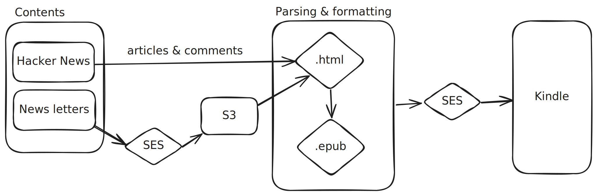

# Kindle Digest

Kindle Digest is a tool that allows you to read Hacker News and newsletters on your Kindle. It fetches the latest content, formats it into a Kindle-friendly format, and sends it directly to your device. Stay updated with your favorite news and articles, all in the convenience of your Kindle.
Inspired by [hn-kindle](https://github.com/sprusr/hn-kindle)

## Features
- Fetches the latest Hacker News articles.
- Supports various newsletters. *(Coming soon™)*
- Formats content for optimal reading on Kindle.
- Automatically sends the formatted content to your Kindle device.

## Architecture


## Setup

### AWS
1. Configure SES for sending emails [link](https://docs.aws.amazon.com/ses/latest/dg/setting-up.html)
2. Configure the lambda

```sh
yarn build:lambda-layer
# upload the zip file to to create a new lambda layer

yarn build:lambda
# upload the zip file to create a new lambda function
```
3. Configure SES for sending emails [link](https://docs.aws.amazon.com/ses/latest/dg/setting-up.html)
4. Invoke a Lambda function on a schedule [link](https://docs.aws.amazon.com/ses/latest/dg/send-email.html)
5. Configure the environment variables in the Lambda function (see below)

### Deploy on your own machine
1. Install the dependencies
```sh
yarn install
```
2. Configure the environment variables
3. Implement your own email sending service (if you don't want to use SES or SendGrid)
4. Run the script
```sh
yarn start
```

## Configuration

Create the file `.env` in the root of this repo, and put the following in it:

```sh
HN_COUNT=10       # how many articles to put in, defaults to 5
MAILTO=           # your Kindle's email address
MAILFROM=         # what address to send from - this will need to be approved in your Amazon settings

TEMP_DIR=output/tmp/ # temporary directory for epub generation
OUTPUT_DIR=output/   # output directory for the epub file
CLEANUP=true         # whether to clean up the output files after sending

# SES settings
MAIL_PROVIDER=ses
AWS_ACCESS_KEY_ID= # AWS access key
AWS_SECRET_ACCESS_KEY= # AWS secret key
AWS_REGION=us-west-2 # AWS region

# SendGrid settings
MAIL_PROVIDER=sendgrid
SENDGRID_API_KEY= # SendGrid API key you get when setting up
```

NOTE: your MAILFROM must be an email approved in your Amazon settings.

## Example
check the [epub](examples/DIGEST-2024-10-19.epub) file or the [hml](examples/DIGEST-2024-10-19.epub.html) file

## License

[MIT](./LICENSE) License © 2024-PRESENT [Donald Shtjefni](https://donld.me)
